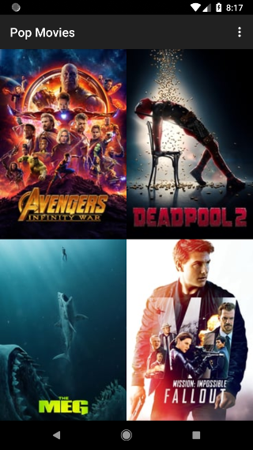
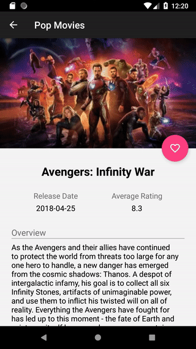

# PopMovies
Browse most popular and top rated movies . Check out trailers, comments and other details. Keep a record of your favorites.

*First project for [Udacity's Android Developer Nanodegree Program](https://eu.udacity.com/course/android-developer-nanodegree-by-google--nd801) (built in partnership with Google).*

## Built with
- `Retrofit` and `RecyclerView` to download and display movie data.
- `SQLite`, `ContentProvider`, `CursorsAdapter` and `CursorLoader` to save (and retrieve) favorites locally. Movie poster bitmap is saved to internal app storage.
- `CardView` used for reviews that auto-collapse on scroll. This is achieved by setting an `onTouchListener` on `RecyclerView` and keeping track of `MotionEvent`s.

## Prerequisites
A unique API key obtained from [TMDb](https://developers.themoviedb.org/3/getting-started/introduction) needs to be placed inside the project's root `gradle.properties` file under `API_KEY=your_key_here`

## Screen captures

## Credits
[TMDb](https://www.themoviedb.org/) - web API for movie details, rankings and posters.

## Licence
This project is licensed under the MIT Licence - see the [LICENCE](LICENCE) file for details.